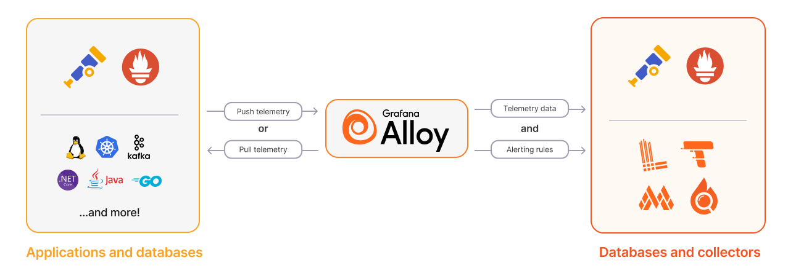

# 🧪 TD-4.1 – Déployer Grafana Alloy sur une app  et monitorer sa machine

## 1) Pré-requis

**Poste étudiant**

* Docker + Docker Compose
* Un navigateur
* (Option) `curl`
* Python ((pas compliqué normalement ;) )

**Côté Grafana Cloud**

* Un compte Grafana Cloud (free account)
* Un “stack” avec :

  * **Metrics** (Prometheus remote_write)
  * **Logs** (Loki)
  
* Un **API Token** (Write: Metrics + Write: Logs)
  
* Les infos “Endpoints” :
  * Remote write URL (metrics)
  * Loki push URL (logs)
  * Username/Instance ID (souvent un numéro) + Token

---

## 2) Architecture du TD

On lance en local (Compose) :

1. `demo-app` : app HTTP + `/metrics` (Prometheus format) + logs JSON sur stdout
2. `prometheus` : scrape `demo-app` (optionnel, utile pour valider localement)
3. `alloy` : collecte métriques + logs et envoie vers **Grafana Cloud Metrics** + **Grafana Cloud Logs (Loki)**

**Flux**

* Metrics : `demo-app` → Alloy (scrape) → Remote Write → Grafana Cloud
* Logs : `demo-app stdout` → Alloy (docker logs) → Loki push → Grafana Cloud

> Remarque : on pourrait faire sans Prometheus local (Alloy scrape direct). Je te donne une version “simple et robuste” : Alloy scrape direct + Prometheus local en bonus de debug.

---

## 3) L’app de démo : métriques + logs “DataOps”

### Endpoints fonctionnels

* `GET /` : OK + log “request”
* `GET /work?items=100` : simule un mini pipeline DataOps (traitement de N “items”)

  * incrémente `dataops_items_total`
  * peut générer des erreurs de validation
  * enregistre latence + statut

### Métriques exposées (exemples)

* `http_requests_total{route,method,status}`
* `http_request_duration_seconds_bucket{route,...}` (histogram)
* `dataops_items_total{result="ok|invalid"}`
* `dataops_batch_duration_seconds` (histogram)
* `app_build_info{version="1.0.0"}`

### Logs JSON (exemples)

* `{"level":"info","msg":"request","route":"/work","status":200,"items":100,"duration_ms":42,"trace_id":"..."}`
* `{"level":"warn","msg":"validation_failed","invalid_items":7,"batch_id":"..."}`
* `{"level":"error","msg":"upstream_timeout","dependency":"warehouse-api"}`

---

## 4) Fichiers fournis aux étudiants

### 4.1 `docker-compose.yml`

> Les étudiants complètent uniquement le `.env` Grafana Cloud.

```yaml
services:
  demo-app:
    build: ./demo-app
    container_name: demo-app
    ports:
      - "8080:8080"
    environment:
      - APP_NAME=demo-app
      - APP_VERSION=1.0.0
      - LOG_FORMAT=json
    labels:
      - "com.example.service=demo-app"

  # Optionnel: utile pour vérifier localement le scrape
  prometheus:
    image: prom/prometheus:latest
    container_name: prometheus
    ports:
      - "9090:9090"
    volumes:
      - ./prometheus/prometheus.yml:/etc/prometheus/prometheus.yml:ro
    depends_on:
      - demo-app

  alloy:
    image: grafana/alloy:latest
    container_name: alloy
    command: ["run", "--server.http.listen-addr=0.0.0.0:12345", "/etc/alloy/config.alloy"]
    ports:
      - "12345:12345" # UI/health Alloy
    volumes:
      - ./alloy/config.alloy:/etc/alloy/config.alloy:ro
      - /var/run/docker.sock:/var/run/docker.sock:ro
    env_file:
      - ./.env
    depends_on:
      - demo-app
```

---

### 4.2 `.env` (à compléter avec leurs valeurs Grafana Cloud)

```bash
    # Grafana Cloud - Metrics (Prometheus remote_write)
    GC_METRICS_URL=__REMOTE_WRITE_URL__
    GC_METRICS_USER=__INSTANCE_ID_OR_USER__
    GC_TOKEN=__GRAFANA_CLOUD_TOKEN__

    # Grafana Cloud - Logs (Loki)
    GC_LOKI_URL=__LOKI_PUSH_URL__
    GC_LOKI_USER=__INSTANCE_ID_OR_USER__
```

> Souvent `GC_METRICS_USER` et `GC_LOKI_USER` sont identiques (instance id). Le token peut être le même si le scope le permet.

---

### 4.3 Config Alloy `alloy/config.alloy`

```yaml
    // ========== METRICS: scrape demo-app ==========
    prometheus.scrape "demo_app" {
    targets = [
        { "__address__" = "demo-app:8080", "job" = "demo-app" },
    ]
    forward_to = [prometheus.remote_write.grafana_cloud.receiver]
    scrape_interval = "5s"
    }

    prometheus.remote_write "grafana_cloud" {
    endpoint {
        url = env("GC_METRICS_URL")
        basic_auth {
        username = env("GC_METRICS_USER")
        password = env("GC_TOKEN")
        }
    }
    }

    // ========== LOGS: read docker logs for demo-app ==========
    loki.source.docker "docker_logs" {
    host             = "unix:///var/run/docker.sock"
    targets          = [{ name = "demo-app" }]
    forward_to       = [loki.write.grafana_cloud.receiver]
    labels = {
        service = "demo-app",
        env     = "td",
    }
    }

    // Option: parse JSON logs & extract fields as labels (attention cardinalité!)
    loki.process "json" {
    forward_to = [loki.write.grafana_cloud.receiver]

    stage.json {
        expressions = {
        level = "level",
        route = "route",
        status = "status",
        }
    }

    // labels utiles (éviter trace_id en label!)
    stage.labels {
        values = {
        level = "level",
        route = "route",
        status = "status",
        }
    }
    }

    loki.write "grafana_cloud" {
    endpoint {
        url = env("GC_LOKI_URL")
        basic_auth {
        username = env("GC_LOKI_USER")
        password = env("GC_TOKEN")
        }
    }
    }
```

> Si tu veux être “safe” côté cardinalité : garde `level` et `route` en labels, mais évite tout identifiant unique !!!!!

---

### 4.4 App de démo (Python minimal) `demo-app/app.py`

```python
    import os, json, time, random, uuid
    from flask import Flask, request, Response
    from prometheus_client import Counter, Histogram, Gauge, generate_latest, CONTENT_TYPE_LATEST

    APP_NAME = os.getenv("APP_NAME", "demo-app")
    APP_VERSION = os.getenv("APP_VERSION", "1.0.0")

    app = Flask(__name__)

    http_requests_total = Counter(
        "http_requests_total", "Total HTTP requests",
        ["route", "method", "status"]
    )
    http_request_duration = Histogram(
        "http_request_duration_seconds", "HTTP request duration",
        ["route", "method"]
    )

    dataops_items_total = Counter(
        "dataops_items_total", "Items processed by result",
        ["result"]
    )
    dataops_batch_duration = Histogram(
        "dataops_batch_duration_seconds", "Batch processing duration seconds"
    )

    up = Gauge("app_up", "App up (1=up)")
    up.set(1)

    def log(level, msg, **fields):
        payload = {
            "level": level,
            "msg": msg,
            "service": APP_NAME,
            "version": APP_VERSION,
            "ts": int(time.time() * 1000),
            **fields,
        }
        print(json.dumps(payload), flush=True)

    @app.before_request
    def start_timer():
        request._t0 = time.time()

    @app.after_request
    def record_metrics(resp):
        route = request.path
        method = request.method
        status = str(resp.status_code)
        http_requests_total.labels(route=route, method=method, status=status).inc()
        http_request_duration.labels(route=route, method=method).observe(time.time() - request._t0)
        return resp

    @app.get("/")
    def index():
        log("info", "request", route="/", status=200, trace_id=str(uuid.uuid4()))
        return {"ok": True, "service": APP_NAME, "version": APP_VERSION}

    @app.get("/work")
    def work():
        items = int(request.args.get("items", "100"))
        batch_id = str(uuid.uuid4())[:8]
        t0 = time.time()

        invalid = 0
        for _ in range(items):
            if random.random() < 0.03:  # 3% invalid
                invalid += 1

        # simulate latency and occasional upstream issue
        time.sleep(random.random() * 0.08)
        if random.random() < 0.02:  # 2% upstream timeout
            log("error", "upstream_timeout", route="/work", status=504, batch_id=batch_id, items=items)
            dataops_items_total.labels(result="invalid").inc(invalid)
            return {"ok": False, "error": "upstream_timeout", "batch_id": batch_id}, 504

        duration = time.time() - t0
        dataops_batch_duration.observe(duration)

        dataops_items_total.labels(result="ok").inc(items - invalid)
        dataops_items_total.labels(result="invalid").inc(invalid)

        if invalid > 0:
            log("warn", "validation_failed", route="/work", status=200, batch_id=batch_id, items=items, invalid_items=invalid, duration_ms=int(duration*1000))
        log("info", "batch_processed", route="/work", status=200, batch_id=batch_id, items=items, invalid_items=invalid, duration_ms=int(duration*1000), trace_id=str(uuid.uuid4()))

        return {"ok": True, "batch_id": batch_id, "items": items, "invalid": invalid, "duration_ms": int(duration*1000)}

    @app.get("/metrics")
    def metrics():
        return Response(generate_latest(), mimetype=CONTENT_TYPE_LATEST)

    if __name__ == "__main__":
        log("info", "starting", port=8080)
        app.run(host="0.0.0.0", port=8080)
```

### 4.5 `demo-app/Dockerfile`

```dockerfile
    FROM python:3.12-slim
    WORKDIR /app
    RUN pip install --no-cache-dir flask prometheus-client
    COPY app.py /app/app.py
    EXPOSE 8080
    CMD ["python", "app.py"]
```

---

### 4.6 Prometheus local (optionnel) `prometheus/prometheus.yml`

```yaml
    global:
    scrape_interval: 5s

    scrape_configs:
    - job_name: "demo-app"
        static_configs:
        - targets: ["demo-app:8080"]
```

---

## 5) Exposer les metrics/logs de votre app

### Étape A — Lancer la stack

  ```bash
  docker compose up --build
  ```

Vérifs rapides :

* App : `http://localhost:8080/`
* Metrics : `http://localhost:8080/metrics`
* Générer du trafic :

  * `http://localhost:8080/work?items=200` (à faire 10–20 fois)
* Prometheus local (optionnel) : `http://localhost:9090`

---

### Étape B — Vérifier arrivée des métriques dans Grafana Cloud

Dans Grafana Cloud → Explore → Metrics (PromQL), tester :

* `sum(rate(http_requests_total[1m]))`
* `histogram_quantile(0.95, sum(rate(http_request_duration_seconds_bucket[5m])) by (le))`
* `sum(rate(dataops_items_total{result="invalid"}[5m]))`

---

### Étape C — Vérifier arrivée des logs dans Loki

Dans Grafana Cloud → Explore → Logs (LogQL), tester :

* `{service="demo-app"}`
* `{service="demo-app"} |= "validation_failed"`
* `{service="demo-app", level="error"}`

---

## 6) Construire le dashboard “DevOps Feedback Loop” (consignes)

Créer un dashboard avec 6 panels (minimum) :

1. **RPS (req/s)**
   PromQL :

  ```promql
  sum(rate(http_requests_total[1m]))
  ```

2. **Taux d’erreur (%)** (HTTP 5xx)

  ```promql
  100 * sum(rate(http_requests_total{status=~"5.."}[5m]))
    / sum(rate(http_requests_total[5m]))
  ```

3. **Latence p95 (s)**

  ```promql
  histogram_quantile(0.95, sum(rate(http_request_duration_seconds_bucket[5m])) by (le))
  ```

4. **Items DataOps invalides / min**

  ```promql
  sum(rate(dataops_items_total{result="invalid"}[1m]))
  ```

5. **Logs récents (table)**
   LogQL :

  ```logql
  {service="demo-app"} | json | line_format "{{.level}} {{.msg}} route={{.route}} status={{.status}} items={{.items}} invalid={{.invalid_items}}"
  ```

6. **Top erreurs (compte sur 10 min)**

  ```logql
  sum by (msg) (
    count_over_time({service="demo-app", level="error"} | json [10m])
  )
  ```

> Bonus corrélation : ajouter un dashboard variable `route` alimentée par `label_values(http_requests_total, route)` et filtrer panels + logs.

---

## 7) Partie “DevOps” (discussion guidée / Questions d'un bon élève NAIL)

* Pourquoi avoir **métriques + logs** plutôt qu’un seul des deux ?
* Quel indicateur te donne :

  * le **symptôme** ? (erreurs, latence)
  * la **cause probable** ? (logs error upstream_timeout)
* Où placerais-tu ton objectif applicatif  ?

  * ex : “99% des requêtes < 60s sur 7 jours”
* Qu’est-ce que c'est une **bonne alerte** ?

---

## Mon point de vue de prof : 

C'est un outil de collect de log/metrics qui a les mêmes standards qu'OpenTelemetry
Lisez bien la documentation de Grafana Alloy :

[https://grafana.com/docs/grafana-cloud/send-data/alloy/introduction/](https://grafana.com/docs/grafana-cloud/send-data/alloy/introduction/)

